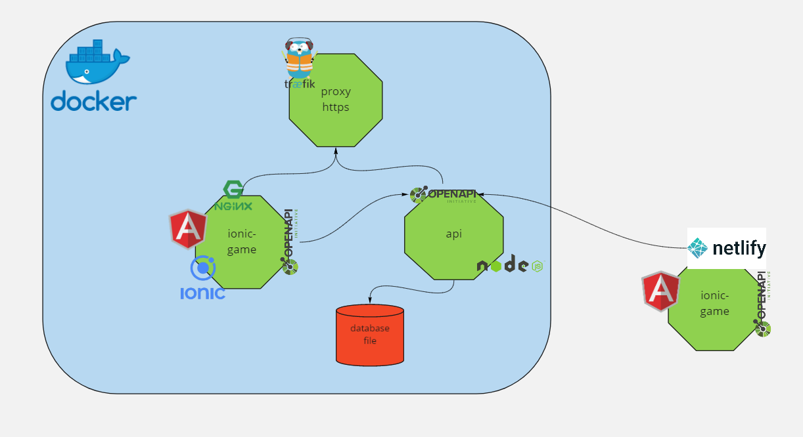

[](https://app.netlify.com/sites/valdepeace-game-pwa/deploys)

# Game Ionic Pwa

Proyect for exercise test ionic with pwa app.

urls de servicios desplegados: 

* front: [game-ionic-pwa.valdepeace.com](https://game-ionic-pwa.valdepeace.com) netlify: [valdepeace-game-pwa.netlify.app ](https://valdepeace-game-pwa.netlify.app/)
* back: [game-ionic-pwa-api.valdepeace.com/api](https://game-ionic-pwa-api.valdepeace.com/api)
* traefik: [traefik.valdepeace.com:8080](https://traefik.valdepeace.com:8080)


## Architectura



enlace [game-ionic-pwa-api](https://github.com/valdepeace/game-ionic-pwa-api) en github

## Estructuras de carpetas

* api: servicios para usar internamente como es el caso del usuario
* game: vista/pagina donde se desarrolla el juego
* shared: carpeta de componentes comunes como puede ser la api implementada pero no se usa
* resources: openapi con las especificaciones de nuestra api

## Herramientas para el desarrollo

* visual code
  * plugins visual code: 
    * Angular Language Service
    * Angular Snippets
    * Auto Ranme Tag
    * Git Graph
    * Git History
    * HTML CSS Supports
    * Ionic Preview    
* [loopback 4 angular application](https://loopback.io/doc/en/lb4/Building-frontend-angular-application.html)
* chrome 
* docker
* netlify
* [traefik](https://doc.traefik.io/traefik/): [traefik del desarrollo](http://traefik.valdepeace.com:8080))
* hub.docker.com: [registry front](https://hub.docker.com/r/negrero/gameionicpwa) [registry api](https://hub.docker.com/r/negrero/gameionicpwaapi)
* [portainer](https://www.portainer.io/)
* [openapi](https://swagger.io/specification/)
  

## Configuraciones

* Se ha introducido proxy en la configuracion de angular y de nuestra app para evitar problemas de cors:
  * (proxy.conf.json)[./proxy.conf.json]
  * (angular.json)[./angular.json]:
  ```
    "serve": {
          "builder": "@angular-devkit/build-angular:dev-server",
          "options": {
            "proxyConfig": "./proxy.conf.json",
            "browserTarget": "app:build"
          },          
  ```
  * También se ha introducido el fichero (netifly.toml)[./netifly.toml] para la configuracion del proxy
## ref
* https://ionicframework.com/blog/start-build-deploy-your-first-capacitor-pwa-with-ionic/
* https://desarrolloweb.com/articulos/primer-progressive-web-app-ionic.html
* https://ankitmaheshwariin.medium.com/build-a-progressive-web-app-pwa-with-ionic-4-ionic-framework-and-firebase-48183519c01
* https://codepen.io/LeeJames206/pen/GrrVme 
* https://loopback.io/doc/en/lb4/
* https://loopback.io/doc/en/lb4/Building-frontend-angular-application.html
* Algun que otro stackoverflow
* https://medium.com/nextfaze/debug-angular-10-karma-tests-in-vscode-9685b0565e8


## test
### Test unitarios
* Service User:
  * Establecer un usuario en el localStorage
  * Obtener un usuario del localStorage
*  
*  

## TODO

* Compodoc
* Storybook
* Conectar con api 
* Probar los correspondientes apis

