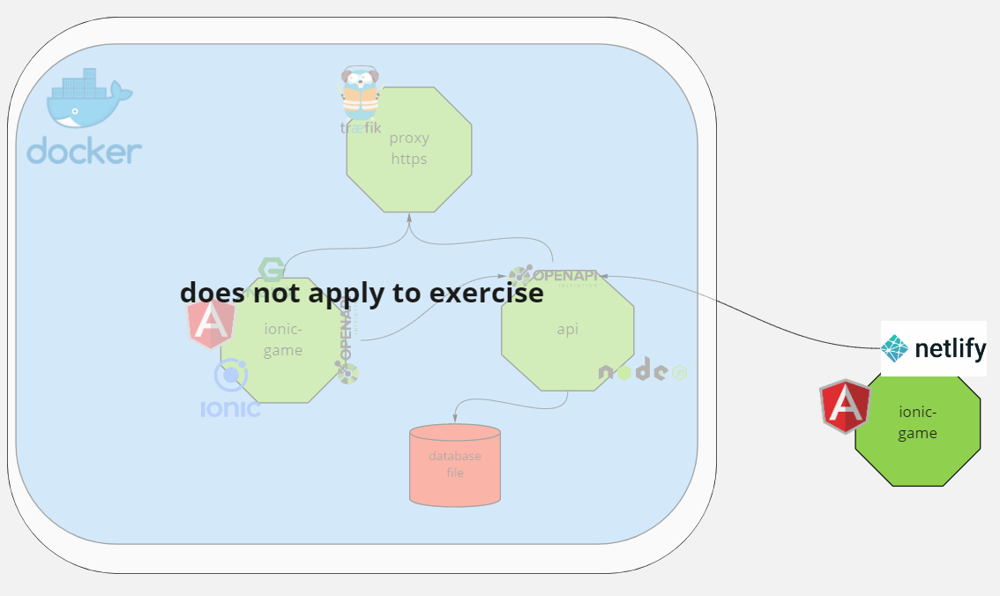
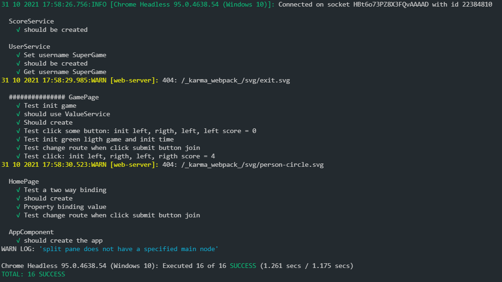

[](https://app.netlify.com/sites/valdepeace-game-pwa/deploys)

# Game Ionic Pwa

Proyect for exercise test ionic with pwa app.

urls de servicios desplegados:

* front: [game-ionic-pwa.valdepeace.com](https://game-ionic-pwa.valdepeace.com) netlify: [valdepeace-game-pwa.netlify.app ](https://valdepeace-game-pwa.netlify.app/)

Las url abajo descritas desarrolladas y desplegadas pero no implementadas en el ejercicio:

* ~~back: [game-ionic-pwa-api.valdepeace.com/api](https://game-ionic-pwa-api.valdepeace.com/api)~~
* ~~traefik: [traefik.valdepeace.com:8080](https://traefik.valdepeace.com:8080)~~


## Architectura



enlace [game-ionic-pwa-api](https://github.com/valdepeace/game-ionic-pwa-api) en github

## Estructuras de carpetas

* api: servicios para usar internamente como es el caso del usuario
* game: vista/pagina donde se desarrolla el juego
* ~~shared: carpeta de componentes comunes como puede ser la api implementada pero no se usa~~
* ~~resources: openapi con las especificaciones de nuestra api~~

## Herramientas para el desarrollo

* visual code
  * plugins visual code: 
    * Angular Language Service
    * Angular Snippets
    * Auto Ranme Tag
    * Git Graph
    * Git History
    * HTML CSS Supports
    * Ionic Preview
    * eslint
    * prettier
    * markdown All in one
    * docker
    * test explorer UI


* ~~[loopback 4 angular application](https://loopback.io/doc/en/lb4/Building-frontend-angular-application.html)~~
* chrome 
* docker
* netlify
* ~~[traefik](https://doc.traefik.io/traefik/): [traefik del desarrollo](http://traefik.valdepeace.com:8080))~~
* ~~hub.docker.com: [registry front](https://hub.docker.com/r/negrero/gameionicpwa) [registry api](https://hub.docker.com/r/negrero/gameionicpwaapi)~~
* ~~[portainer](https://www.portainer.io/)~~
* ~~[openapi](https://swagger.io/specification/)~~
  

## Configuraciones

* ~~Se ha introducido proxy en la configuracion de angular y de nuestra app para evitar problemas de cors:~~
  * (proxy.conf.json)[./proxy.conf.json]
  * (angular.json)[./angular.json]:
  ```
    "serve": {
          "builder": "@angular-devkit/build-angular:dev-server",
          "options": {
            "proxyConfig": "./proxy.conf.json",
            "browserTarget": "app:build"
          },          
  ```
  * ~~También se ha introducido el fichero (netifly.toml)[./netifly.toml] para la configuracion del proxy~~

## test

Para los test se ha usado las propias herramientas que nos proporciona angular que son jasmine y karma como test manager.

Tambien se ha utilizado una configuracion para hacer el debug con vscode [karma.config.js](./karma.conf.js):

```javascript
 reporters: ['spec'],
    
    port: 9876,
    colors: true,
    logLevel: config.LOG_INFO,
    autoWatch: true,
    
    browsers: ["ChromeHeadlessNoSandbox"],
    customLaunchers: {
      ChromeHeadlessNoSandbox: {
        base: "ChromeHeadless",
        flags: [
          "--no-sandbox", // required to run without privileges in docker
          "--user-data-dir=/tmp/chrome-test-profile",
          "--disable-web-security",
          "--remote-debugging-port=9222",
        ],
        debug: true,
      },
    },
    singleRun: false,
    restartOnFileChange: true,

```

### Test unitarios

* Service User:
  * Establecer un usuario en el localStorage
  * Obtener un usuario del localStorage
* Page home:
  * should create: si se ha creado el componente
  * Property binding value: si el componente enlaza con el input html
  * Test a two way binding: testea el doble binging
  * Test change route when click submit button join: testea el cambio de route cuando pulsamos sobre el boton join
* Page game:
  * should create: testea que el componente se crea
  * should use ValueService: Testea el servicio de usuario que guarda en localStorage
  * Test click: init left, rigth, left, rigth score = 4: testea lafuncionalidad izquierda-derecha
  * Test click some button: init left, rigth, left, left score = 0: testea la funcionalidad pulsar dos veces el mismo boton
  * Test init green ligth game and init time: testea que el juego se inicia
  * Test change route when click submit button join: testea el cambio de ruta cuando pulsamos el boton salir



## TODO

* Compodoc
* Storybook
* Conectar con api
* Probar los correspondientes apis

## ref

* <https://ionicframework.com/blog/start-build-deploy-your-first-capacitor-pwa-with-ionic/>
* <https://desarrolloweb.com/articulos/primer-progressive-web-app-ionic.html>
* <https://ankitmaheshwariin.medium.com/build-a-progressive-web-app-pwa-with-ionic-4-ionic-framework-and-firebase-48183519c01>
* <https://codepen.io/LeeJames206/pen/GrrVme>
* <https://loopback.io/doc/en/lb4/>
* <https://loopback.io/doc/en/lb4/Building-frontend-angular-application.html>
* Algun que otro stackoverflow
* <https://medium.com/nextfaze/debug-angular-10-karma-tests-in-vscode-9685b0565e8>
* Musica mientra he desarrollado: 
  * [The Prodigy Medley [new edit 2020] Prime Orchestra live cover](https://www.youtube.com/watch?v=Kg-RjuLPqLM)
  * [Fatboy Slim - Lockdown Mixtape (Week 4)](https://www.youtube.com/watch?v=jHBKEr5OMFI)
  * [Tujamo vs. La Fuente - Funk You (Official Music Video)](https://www.youtube.com/watch?v=U8MEWxt4iSw)
  * ......